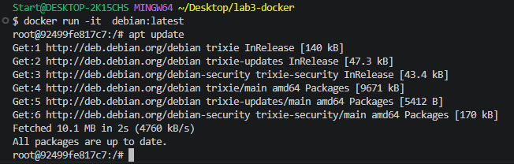
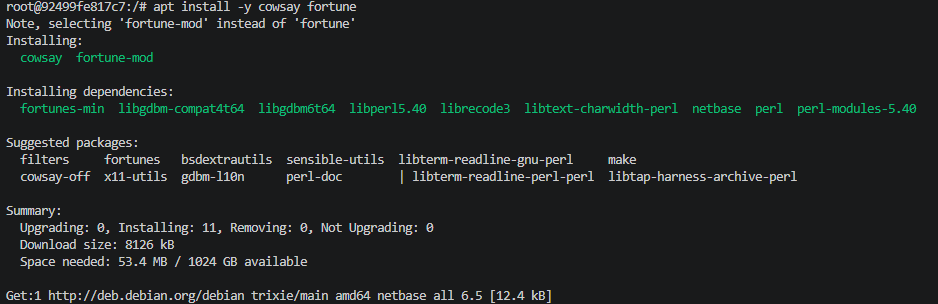
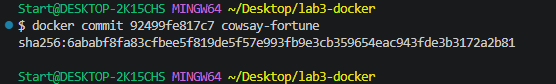
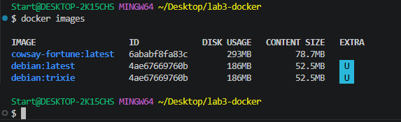
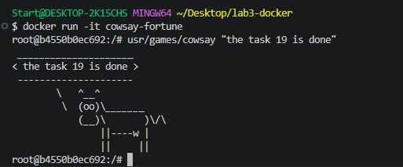
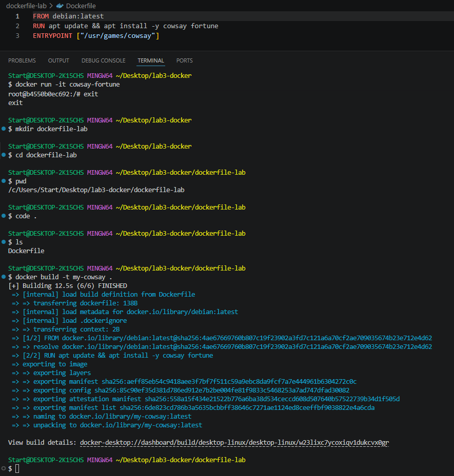
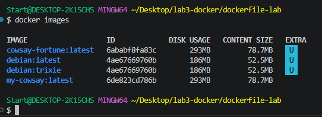

# Лабораторная работа №3. Работа с Docker

## Цель работы
Освоить основные команды Docker, работу с образами и контейнерами, а также создание собственных образов на основе Dockerfile.

---

## 1. Показать версию Docker

Проверка установленной версии Docker командой `docker -v`.

---

## 2. Авторизация в Docker Hub

Выполнен вход в Docker Hub командой `docker login`.

---

## 3. Поиск образов Debian

Поиск всех репозиториев, содержащих слово `debian`.

---

## 4. Просмотр списка образов

Просмотр локально сохранённых образов командой `docker images`.

---

## 5. Просмотр всех контейнеров

Отображение всех контейнеров командой `docker ps -a`.

---

## 6. Просмотр запущенных контейнеров

Отображение только активных контейнеров командой `docker ps`.

---

## 7. Загрузка образа Debian:trixie

Скачивание образа `debian:trixie`.

---

## 8. Загрузка образа Debian:latest

Скачивание образа `debian:latest`.

---

## 9. Проверка контейнеров после загрузки образов

Повторная проверка списка контейнеров.

---

## 10. Проверка запущенных контейнеров

Просмотр активных контейнеров.

---

## 11. Проверка списка образов

Проверка успешной загрузки образов Debian.

---

## 12. Запуск контейнера по имени образа

Запуск контейнера с использованием имени образа.

---

## 13. Запуск контейнера `cont-no1` по идентификатору образа

Создание контейнера с указанным именем по ID образа.

---

## 14. Запуск контейнера `cont-no2` в интерактивном режиме

Запуск контейнера с параметрами `-it` для подключения к терминалу.

---

## 15. Просмотр всех контейнеров

Проверка созданных контейнеров.

---

## 16. Просмотр активных контейнеров

Проверка списка запущенных контейнеров.

---

## 17. Создание контейнера с cowsay и fortune

### Шаг 17.1

Подготовка окружения и создание образа.

### Шаг 17.2

Установка необходимых пакетов `cowsay` и `fortune`.

### Шаг 17.3

Завершение сборки контейнера.

---

## 18. Подтверждение создания образа

Проверка наличия созданного образа в списке Docker-образов.

---

## 19. Демонстрация работы cowsay

Запуск контейнера и вывод сообщения через `fortune | cowsay`.

---

## 20. Создание Dockerfile

Создан Dockerfile, содержащий установку `cowsay` и `fortune`, а также настройку точки входа (`ENTRYPOINT`).

---

## 21. Проверка созданного образа

Подтверждение успешной сборки образа на основе Dockerfile.

---

## Структура проекта

- `Dockerfile` — основной Dockerfile.
- `dockerfile-lab/Dockerfile` — Dockerfile для задания с cowsay и fortune.
- `screenshots/` — скриншоты выполнения всех пунктов лабораторной работы.
